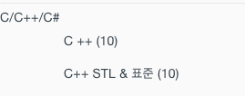

# jekyll 에서 카테고리를 모아서 표시하는 방법에 대해 설명 합니다.
아래와 같이 카테고리가 메뉴가 추가되고 포스트 개수를 표시하게 된다.  
> 

여기서는 'cpp' 카테고리를 만드는 예로 설명한다.  

1. category-cpp.md 를 만든다.
2. category-cpp.md 에 다음의 front matter를 작성한다.
```md
---
title: "C++ 프로그래밍"
layout: post
permalink: categories/cpp
---
```
3. 아래의 내용을 작성한다. (코드블럭으로 넣으면 링크된 파일이 표시되어서 부득이 그림으로 넣었다. 나중에 수정예정)

       
